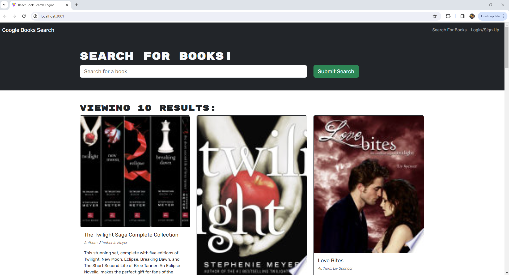

# Book Search Engine

## Description

This app was a fully functional Google Books API search engine built with a RESTful API that was refactored to a GrapghQL API built with Apollo Server. The app was built using the MERN stack, with a React front end, MongoDB database, and Node.js/Express.js server and API.

## Installation

Run 'npm install' then 'npm run develop' to run locally

## Deployment

Could not get Render to cooperate but you can run this app locally.

https://github.com/G2Squared/book-search-engine.git

## License

